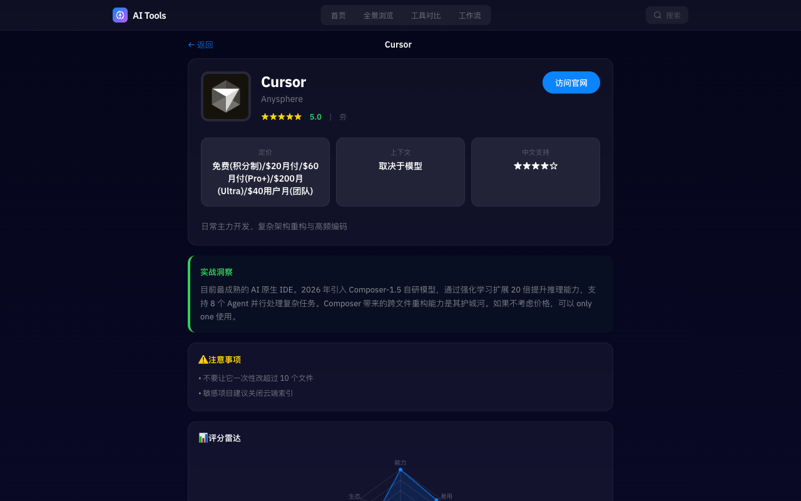
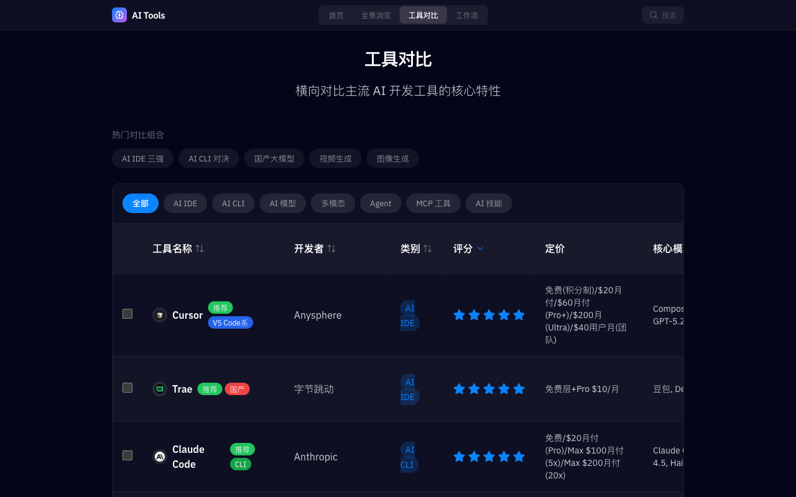

<p align="center">
  
</p>

<h1 align="center">AI Tools Handbook</h1>

<p align="center">
  <strong>125+ 款 AI 工具深度评测与选型指南 — 2026 深度集成与实战教学版</strong>
</p>

<p align="center">
  <a href="https://aitools.rxcloud.group"></a>
  <a href="https://github.com/ava-agent/ai-tools"></a>
  <a href="https://opensource.org/licenses/MIT"></a>
</p>

<p align="center">
  <a href="https://aitools.rxcloud.group">在线访问</a> · <a href="https://github.com/ava-agent/ai-tools/issues">提交反馈</a> · <a href="#快速开始">快速开始</a>
</p>

---

## 预览

<p align="center">
  
  <br>
  <em>首页 — 星空节点网络背景 · 125+ 工具 · 7 大类别 · 1742 条实战洞察</em>
</p>

<details>
<summary>📸 更多页面截图</summary>

### 全景浏览 — 工具卡片网格

<p align="center">
  
</p>

### 工具详情 — SWOT 分析 · 雷达图 · 实战洞察

<p align="center">
  
</p>

### 横向对比 — 最多 4 款工具同屏对比

<p align="center">
  
</p>

### 工作流指南 — 6 套实战工作流模板

<p align="center">
  
</p>

</details>

---

## 特性

| 功能 | 说明 |
|------|------|
| **125+ 工具评测** | 覆盖 AI IDE、LLM、CLI、多模态、Agent、MCP、AI 技能等 7 大类别 |
| **SWOT 分析** | 每个工具的优势、劣势、机会、威胁深度分析 |
| **雷达图评分** | 功能、性能、易用性、生态、性价比五维可视化 |
| **智能筛选** | 按类别、标签、开发者、评分快速筛选 |
| **横向对比** | 最多 4 款工具同屏对比核心特性 |
| **工作流指南** | 6 套基于实战经验的 AI 工具组合工作流 |
| **社区功能** | 工具评分、评论、Battle 投票（Supabase 驱动） |
| **游戏化** | 经验值、成就系统、个性测试、每日推荐 |
| **PWA 离线** | Service Worker 离线缓存，随时随地使用 |

---

## 工具版图

```
┌─────────────────────────────────────────────────────────┐
│                    AI Tools · 125+                      │
├──────────┬──────────┬──────────┬──────────┬──────────────┤
│ 🖥 IDE   │ 💻 CLI   │ 🧠 模型  │ 🎨 多模态│ 🤖 智能体    │
│   13     │   12     │   18     │   21     │   20         │
├──────────┴──────────┼──────────┴──────────┴──────────────┤
│ 🔌 MCP 工具  22     │ ⚡ AI 技能  19                     │
└─────────────────────┴───────────────────────────────────┘
```

| 类别 | 数量 | 代表工具 |
|------|:----:|---------|
| **AI 开发环境** | 13 | Cursor, Trae, Windsurf, Kiro, Qoder |
| **AI 命令行** | 12 | Claude Code, Codex, Gemini CLI, Crush |
| **AI 模型** | 18 | Claude 4.5, GPT-5.2, Gemini 3, DeepSeek, Qwen3 |
| **AI 多模态** | 21 | Midjourney, 可灵, FLUX, Sora, ElevenLabs |
| **AI 智能体** | 20 | Claude Agent SDK, Devin, Bolt.new, n8n |
| **MCP 工具** | 22 | Context7, Playwright MCP, GitHub MCP, Supabase MCP |
| **AI 技能** | 19 | ui-ux-pro-max, semgrep, research, mcp-builder |

---

## 快速开始

```bash
# 克隆仓库
git clone https://github.com/ava-agent/ai-tools.git
cd ai-tools/website

# 安装依赖并启动
npm install
npm run dev
```

访问 http://localhost:8765 即可查看。

### 配置 Supabase（可选）

社区功能（评分、评论、云同步）需要 Supabase：

```bash
cp .env.example .env
# 编辑 .env，填入 Supabase 项目信息
```

未配置 Supabase 时，网站仍可正常运行，社区功能将自动隐藏。

---

## 技术栈

```
Vue 3.4 + Vite 5 + Tailwind CSS 3.4 + Pinia + Vue Router + Supabase + Vercel
```

| 层面 | 技术 |
|------|------|
| **前端框架** | Vue 3 Composition API + `<script setup>` |
| **构建工具** | Vite 5，ES2020 目标，代码分割 |
| **样式** | Tailwind CSS 深色主题 + Glassmorphism |
| **状态管理** | Pinia（tools, ui, auth, gamification, achievements, community） |
| **后端** | Supabase（认证、数据库、云同步） |
| **部署** | Vercel（自动 CI/CD）/ Docker + Nginx |
| **测试** | Vitest + Vue Test Utils |

---

## 开发命令

```bash
npm run dev              # 开发服务器（:8765）
npm run build            # 生产构建
npm run preview          # 预览构建（:8766）
npm run lint             # ESLint 检查（自动修复）
npm run format           # Prettier 格式化
npm run test             # Vitest 测试
npm run test:coverage    # 测试覆盖率报告
```

### Docker 部署

```bash
docker build -t ai-tools .
docker run -p 8080:80 ai-tools
```

---

## 贡献

欢迎提交 PR 来添加新工具或改进现有内容！

1. Fork 项目
2. 创建特性分支：`git checkout -b feature/your-feature`
3. 提交更改：`git commit -m 'Add: 新功能描述'`
4. 推送分支：`git push origin feature/your-feature`
5. 创建 Pull Request

---

## 许可证

[MIT License](LICENSE) - 自由使用，保留版权声明即可。
